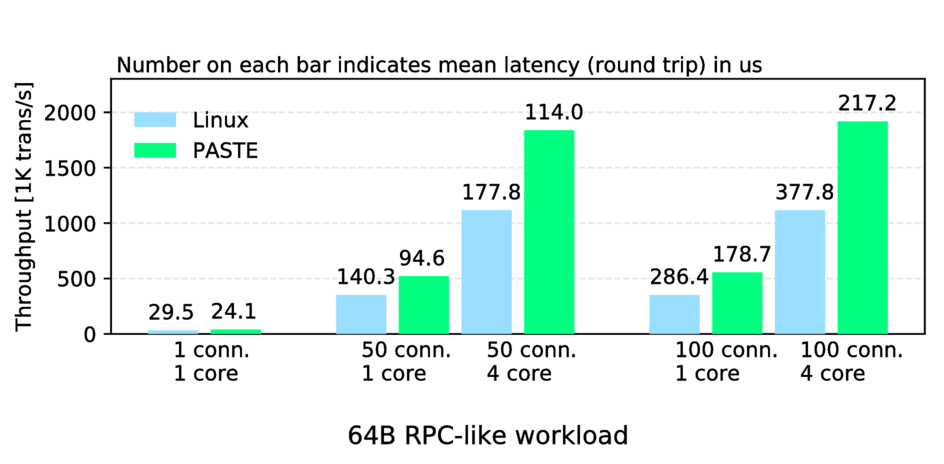
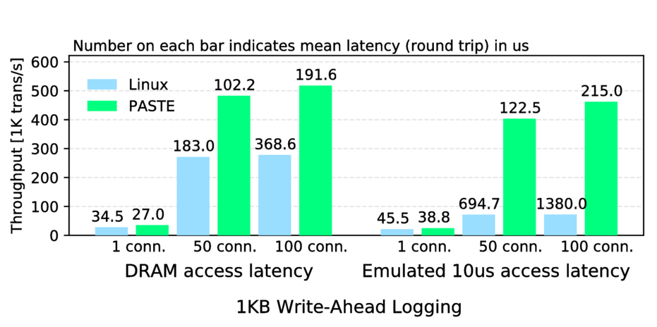
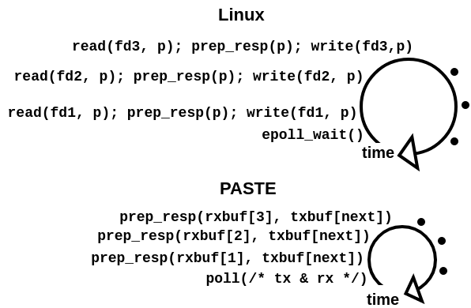

<!-- Place this tag where you want the button to render. -->
<a class="github-button" href="https://github.com/micchie/netmap"
data-icon="octicon-star" aria-label="Star micchie/netmap on GitHub">Star</a>
<!-- Place this tag in your head or just before your close body tag. -->
<script async defer src="https://buttons.github.io/buttons.js"></script>
<a
href="https://twitter.com/intent/tweet?screen_name=michioh&ref_src=twsrc%5Etfw"
class="twitter-mention-button" data-show-count="false">Tweet to
@michioh</a><script async src="https://platform.twitter.com/widgets.js"
charset="utf-8"></script>
## Overview

PASTE provides scalability to concurrent TCP
connections by system call and I/O batching, multi-core scalability by
parallel, zero-copy data paths on a multi-queue NIC, and abstractions to build
storage stacks directly with packet buffers on regular or non-volatile main
memory.  It utilizes the kernel TCP/IP implementation that supports various
modern extensions.

## Resources

[The paper, slides and presentation](https://www.usenix.org/conference/nsdi18/presentation/honda)
at [USENIX NSDI 2018](https://www.usenix.org/conference/nsdi18)

[Slides](https://www.bsdcan.org/2018/schedule/attachments/454_BSDCan-PASTE.pdf)
and [presentation](https://youtu.be/y_F-8HijfOA) at [BSDCan](https://www.bsdcan.org/2018/)

<!--[Slides at Dagstuhl seminar](https://www.usenix.org/conference/nsdi18/presentation/honda)-->

## Reference

For further information and to refer to PASTE, please use following entry:
```
@InProceedings{Honda18,
  author    = {Michio Honda, Giuseppe Lettieri, Lars Eggert and Douglas Santry},
  title     = {PASTE: A Network Programming Interface for Non-Volatile Main Memory},
  booktitle = {USENIX NSDI},
  year      = {2018},
}
```

## Contact

Michio Honda (Email: micchie AT sfc DOT wide DOT ad DOT jp, Twitter: @michioh)

## Performance

All the experiments below run Linux kernel 4.14 enabling or disabling PASTE at
the server machine (Xeon Silver 4110 @ 2.10 Ghz).  The client machine (Xeon
E5-2690v4 @ 2.60 Ghz) runs the same Linux kernel without PASTE and acts as a
workload generator using [wrk](https://github.com/wg/wrk).  These machines are
connected back-to-back with Intel x540 10 GbE NICs.  The kernel configuration
file is [here](https://gist.github.com/micchie/07a8b5482bcdb8ed8eb9ae63e92d140e).
<!--
convert -density 200 -quality 100 -resize 100\% ./paste-rpc.pdf ./paste-rpc.png 
-->


The first graph shows RPC-like workload where the Linux client transmits a 44
byte data and receives 151 byte of response (includes 64 byte of contents after
the HTTP OK header) over persistent TCP connections.


The second graph shows Write-Ahead Logging workload where the client transmits 1156 byte of message
(includes 1024 byte of contents after the HTTP POST header) and receives 151 byte of response.
The server persists receiving data on emulated persistent memory (PM) using clflushopt and mfence.

The left half bars show throughput and mean latency with DRAM access latency (~70ns),
mimicking performance over NVDIMM-N.
The right half bars show those over higher access latency (~10us). It therefore mimics
performance with PM that is slower but cheaper and higher-capacity than DRAM,
like Intel 3D-Xpoint.

Let's start with understanding performance improvements in the first graph.
In standard Linux, *ready* file descriptors (i.e., TCP connections) fetched by
epoll_wait() are processed in turn, issuing a pair of read() and write() on each
of them (Linux in the picture below).  This process includes significant overheads; in
addition to two system call costs on every file descriptor, we cannot exploit
batching at packet I/O over multiple write()s across multiple file descriptors.


In PASTE, packet buffers for all the TCP connections receiving data are made
available by poll(), and the app does not need to issue system calls or to copy
data on each descriptor (PASTE in above picture). Packet transmission
is done in the next poll() for all the TCP connections at once, which efficiently
batches packet I/O, merging NIC doorbell and improving locality.
<!-- (1222 B ethernet frame) to the server, and receives a 217 B ethernet frame as response. -->

Now let's understand the second graph.
Here there are two key techniques in addition to system call and I/O batching
explained above.

First one is avoiding data copy even to PM.
PASTE can statically organize packet buffers on PM-backed file (i.e., a file on
DAX-enabled file system), each of them is identified by a unique index.
Therefore, the indices and buffers (i.e., file's contents) survive reboots.
The app mmap()s the packet buffers region of the file beforehand, and receives a
list of buffer indices with ready data, such as in-order TCP segments.
The app then explicitly flushes data, because modern DMA happens to the last
level CPU cache (a.k.a. DDIO). This feature is rather nice because we can avoid
flushing unnecessary data, such as "Get" requests.
The app can hold flushed buffers by returning indices of free buffers to the
kernel. One might think data copy should not be so expensive. But this depends
on scenario. When reusing the same source and/or destination memory address over
and over, data copy is indeed cheap as these addresses are already in the CPU
cache.  But when storing or persisting data, we usually cannot overwrite
existing contents. Data copy to new location is expensive, causing cache misses
or evictions.  We ran PASTE with copying data to the emulated PM, and observed
373.5K requests per second (RPS) with 50 concurrent TCP connections (not plotted in the
graph) as opposed to 483.1 K RPS with zero copy.

The second technique is to overlap flushes and request processing.
Flushing data from CPU caches to (persistent) main memory is expensive operation
due to access latency (tens of ns with DRAM and NVDIMM-N, and several us with
Intel 3D-Xpoint).
With PASTE, since packet transmission does not happen until the next poll(), we
can continue processing next data while flushing previous data is still ongoing
(clflushopt works in a write-back manner). The app only needs to wait for all the
flushes being done before the next poll() by mfence.  Thus, the more concurrent
requests the app receives, the more flushes it can overlap.  This is why PASTE
demonstrates higher throughput with 100 concurrent connections than
with 50 ones, particularly in the case that emulates high PM access latency in
the second graph.  On the other hand, in the regular socket API, we have to wait
for flushes being done before every write().
Thus, in the experiments that emulate PM access latency, we inserted a 10 us
loop before poll() in PASTE, or write() in Linux.

## FAQs

1. **Is persistent memory mandatory to use PASTE?**

    **No**. You can use PASTE just as fast network stack, such as to build RPC server or
    alongside existing storage components.  You can also build in-memory data
    store using same data structures with the persistent memory case.

2. **Can I prototype a storage stack on persistent memory without real device?**

   **Yes**. you can [emulate persistent memory in a region of DRAM](http://pmem.io/2016/02/22/pm-emulation.html).
   In fact currently the persistent memory stack (DAX) is only available in Linux.

3. **Why not user-space TCP/IP stack?**

    User-space TCP/IP stacks lack many TCP features to cope with various
    network conditions in real networks, such as modern congestion
    control and loss recovery mechanisms, and other extentions. In other
    words, conforming to RFC 793 and 1323 does not mean full-fridge TCP anymore.

    Most benefits of user-space TCP/IP stem from API and packet I/O improvements
    , not from protocol implementations. PASTE takes the same advantages while
    preserving modern, stable TCP/IP implementation in the kernel.

## Getting started

### 1. Supported OSes

- [Linux 4.6 to 4.15 (ixgbe, i40e NICs) or 4.17 (e1000 NIC)](https://www.kernel.org/) (4.14 is recommended)
- [FreeBSD CURRENT](https://github.com/freebsd/freebsd)

### 2. Linux Installation
### 2.1 Compile

1. Download [netmap implementation](https://https://github.com/micchie/netmap)
2. Follow the instructions in [LINUX/README](https://github.com/micchie/netmap/blob/paste/LINUX/README) but add `--enable-stack` on `configure`.

### 2.2 System configuration
### 2.2.1 NIC

As explained in [netmap usage](https://github.com/luigirizzo/netmap/blob/master/LINUX/README),
disable all the offload settings. But for PASTE, please enable TX checksum offloading.
You can do so like `ethtool -K eth1 tx-checksum-ip-generic on` (ixgbe and e1000) or `ethtool -K
eth1 tx-checksum-ipv4 on` (i40e). It doesn't really enable checksum offloading
but is needed for internal reasons.

### 2.2.2 Linux kernel

For use of PM, Linux kernel must be configured properly.
Just use [this
configuration](https://gist.github.com/micchie/07a8b5482bcdb8ed8eb9ae63e92d140e)
(add/remove device drivers if necessary)

### 2.3 Setting up emulated persistent memory

See [here](http://pmem.io/2016/02/22/pm-emulation.html).
In short, pass `memmap=8G!24G` (reserve 8GB at 24GB offset of DRAM)
or something to GRUB argument.

### 3. FreeBSD Installation
### 3.1 Compile

1. Prepare [FreeBSD source tree](https://github.com/freebsd/freebsd) in your system (we assume `/usr/src`)
2. Download [netmap implementation](https://github.com/micchie/netmap) (e.g., in your home directory)
3. Copy `netmap/sys/net/*` to `/usr/src/sys/net/` and `netmap/sys/dev/netmap/netmap*`  to `/usr/src/sys/dev/netmap/`
4. Edit `/usr/src/sys/conf/files` to contain following lines
```
dev/netmap/netmap_bdg.c optional netmap
dev/netmap/netmap_stack.c optional netmap
```
5. Compile the kernel in the normal way (see [FreeBSD handbook](https://www.freebsd.org/doc/handbook/kernelconfig-building.html))

### 3.2 System configuration

- Disable all the offloading settings as in [netmap man page](https://www.freebsd.org/cgi/man.cgi?query=netmap&sektion=4#end)

### 4. Running example app

1. Go to `netmap/libnetmap`, then `make`
2. Go to `netmap/apps/phttpd`, then `make`
3. `sudo ./phttpd -i YOUR_NIC`
    For example, YOUR_NIC would be eth1. See more help by `./phttpd -h`
4. At client on another machine, install and run `wrk`
   e.g., `wrk -d 2 -c 50 -d 50 http://192.168.0.2:60000/`.
